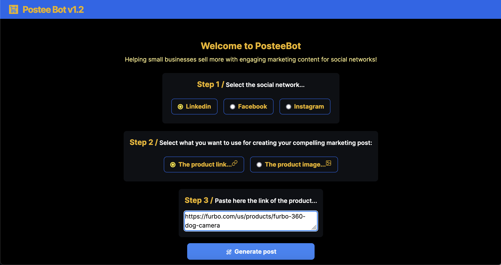
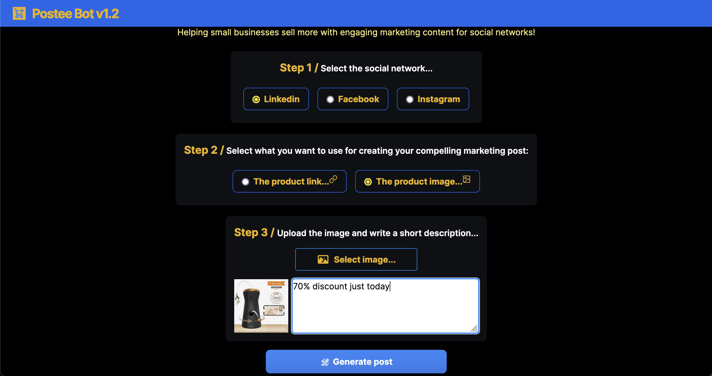
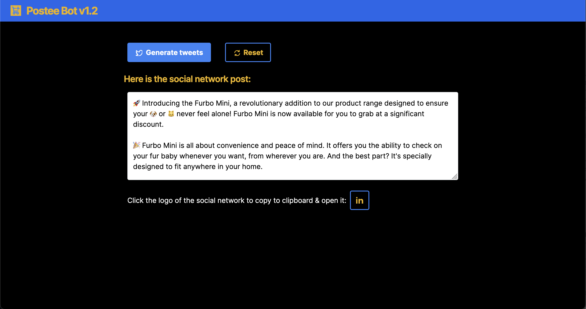
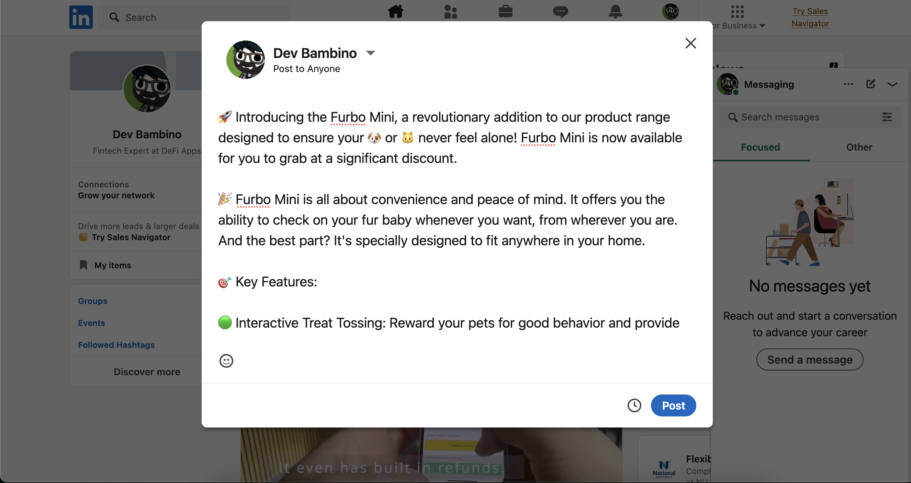
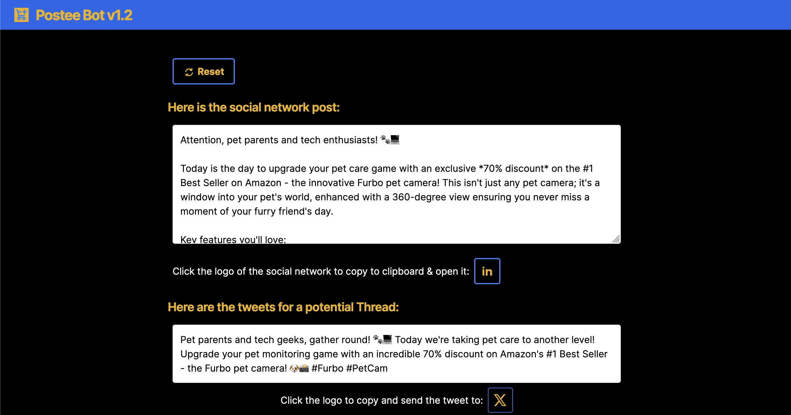
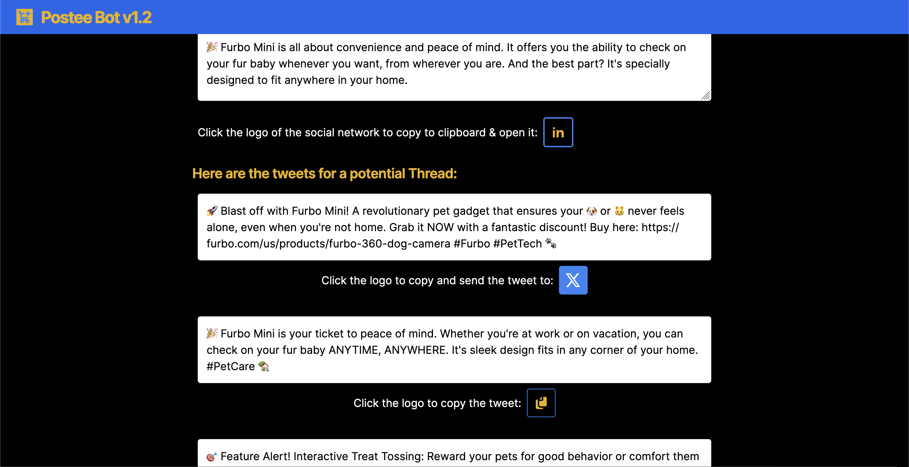
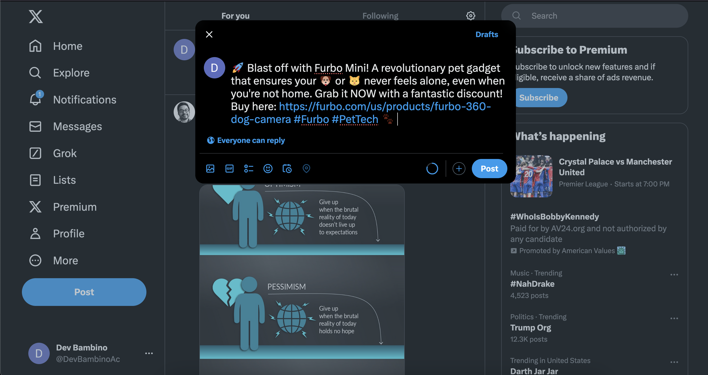
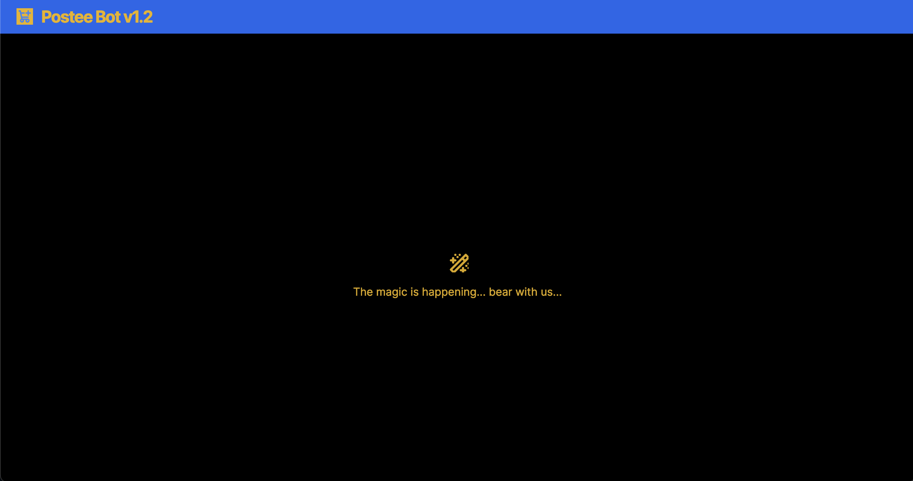

# 🤖 PosteeBot: Your AI-Powered Social Media Marketing Partner! 

PosteeBot is a cutting-edge AI react.js app designed to help small businesses sell more by generating from their e-commerce sites really engaging and captivating marketing content for social media platforms like LinkedIn, Facebook, and Instagram. ✨ 

**Demo:** https://postee-bot-3pvcqzxkfa-uc.a.run.app/

## Here's how it works:

*   **Step 1: Select Your Platform 📢** Choose the social media platform where you want to post your content. 
*   **Step 2: Choose Your Input 🔗🖼️** Decide whether you want to use a product link or an image as the basis for your post. 
*   **Step 3: Provide Details ✍️** If using an image, upload it and add a brief description. For links, simply paste the URL. 

*   **Generate & Share! 🪄** Click "Generate Post" and PosteeBot will craft compelling marketing copy tailored to your chosen platform, complete with relevant emojis and hashtags. You can then easily copy the text and share it directly on your social media. 

**PosteeBot also offers an innovative "Generate Tweets" feature to create engaging Twitter threads from your post!** 🧵

## On the shoulders of giants:

PosteeBot leverages the power of Azure OpenAI to deliver:

*   🎯 **Targeted Content:**  Platform-specific language and style for optimal engagement. 
*   💼 **Professional Tone:**  Maintains professionalism while adding personality.  
*   ✅ **Visual Storytelling:**  Strategic use of emojis to enhance the message.  
*   #️⃣ **Hashtag Optimization:**  Includes relevant hashtags for increased visibility.   
*   🛡️ **Committed to Responsible AI:** We've implemented safety measures to prevent our AI from generating harmful content. This includes filtering for categories like harassment, hate speech, sexually explicit material, and dangerous suggestions.

This app is using Azure OpenAI javascript SDK from [here](https://learn.microsoft.com/en-us/javascript/api/overview/azure/openai-readme?view=azure-node-preview)

**PosteeBot is your one-stop solution for creating high-quality social media content that drives results!** 🚀

#SocialMediaMarketing #AI #ReactJS #SmallBusiness #MarketingTools #ContentCreation #PosteeBot 

## How to use it:

### Install all the dependencies
`npm install`

### Add your Azure AI api key and ednpoint
Include your Azure AI api key and endpoint inside .env with the variable name: 
`AZURE_OPENAI_API_KEY="your_key_here"`
`AZURE_OPENAI_ENDPOINT="your_endpoint_here"`

> [!WARNING]
> (For Judges) If you don't do that then the app will ask you to enter the api key and endpoint the first time you try to generate a post. The credentials you enter there are not stored permanently anywhere in the app and they are going to be available just while you have the page open. If you don't have a valid Azure OpeanAI apikey/endpoint and you are a judge, then send me an email to devbambinoacc@gmail.com and I would share my credentials with you.

### Run the app
`npm run dev`

### Testing product links and product images

List of 56 Shopify stores: [Click here](https://www.referralcandy.com/blog/shopify-websites)

A product page for a dog camera, copy the link: [Click here](https://furbo.com/us/products/furbo-360-dog-camera)

The corresponding image for the dog camera, so download it and then click "select image" inside the app: [Click here](https://images.prismic.io/furbo-prismic/baebe4b9-ea9d-422a-a2ba-26b63e25c0d7_DOG+PDP_Prod+img_1.jpg?auto=compress%2Cformat&fit=max&w=3840)

## Troubleshooting

The feature generating a post from an url is doing web scraping to extract the text from the web page shared. If you are running the app in Localhost then a Cross-Origin Resource Sharing (CORS) issue would occur. To fix the issue you would need to use the Firefox web browser and install the extension [CORS Everywhere](https://addons.mozilla.org/en-US/firefox/addon/cors-everywhere/).

## License

3-Clause BSD license.

Copyright (c) 2024, Fredy Del Vecchio (aka Dev Bambino)

Redistribution and use in source and binary forms, with or without modification, are permitted provided that the following conditions are met:

1. Redistributions of source code must retain the above copyright notice, this list of conditions and the following disclaimer.

2. Redistributions in binary form must reproduce the above copyright notice, this list of conditions and the following disclaimer in the documentation and/or other materials provided with the distribution.

3. Neither the name of the copyright holder nor the names of its contributors may be used to endorse or promote products derived from this software without specific prior written permission.

THIS SOFTWARE IS PROVIDED BY THE COPYRIGHT HOLDERS AND CONTRIBUTORS “AS IS” AND ANY EXPRESS OR IMPLIED WARRANTIES, INCLUDING, BUT NOT LIMITED TO, THE IMPLIED WARRANTIES OF MERCHANTABILITY AND FITNESS FOR A PARTICULAR PURPOSE ARE DISCLAIMED. IN NO EVENT SHALL THE COPYRIGHT HOLDER OR CONTRIBUTORS BE LIABLE FOR ANY DIRECT, INDIRECT, INCIDENTAL, SPECIAL, EXEMPLARY, OR CONSEQUENTIAL DAMAGES (INCLUDING, BUT NOT LIMITED TO, PROCUREMENT OF SUBSTITUTE GOODS OR SERVICES; LOSS OF USE, DATA, OR PROFITS; OR BUSINESS INTERRUPTION) HOWEVER CAUSED AND ON ANY THEORY OF LIABILITY, WHETHER IN CONTRACT, STRICT LIABILITY, OR TORT (INCLUDING NEGLIGENCE OR OTHERWISE) ARISING IN ANY WAY OUT OF THE USE OF THIS SOFTWARE, EVEN IF ADVISED OF THE POSSIBILITY OF SUCH DAMAGE.
